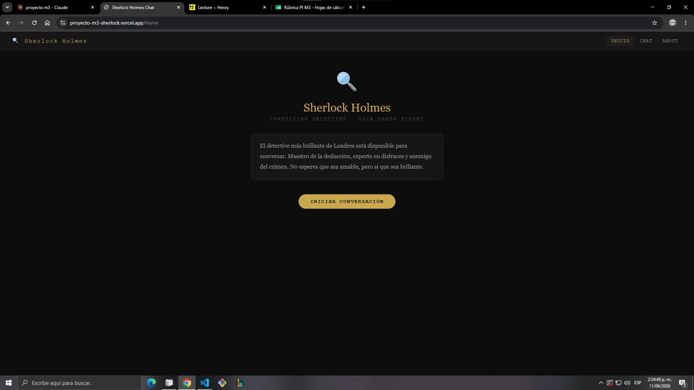
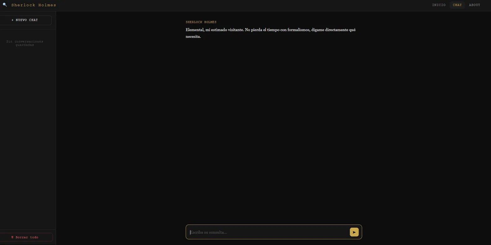
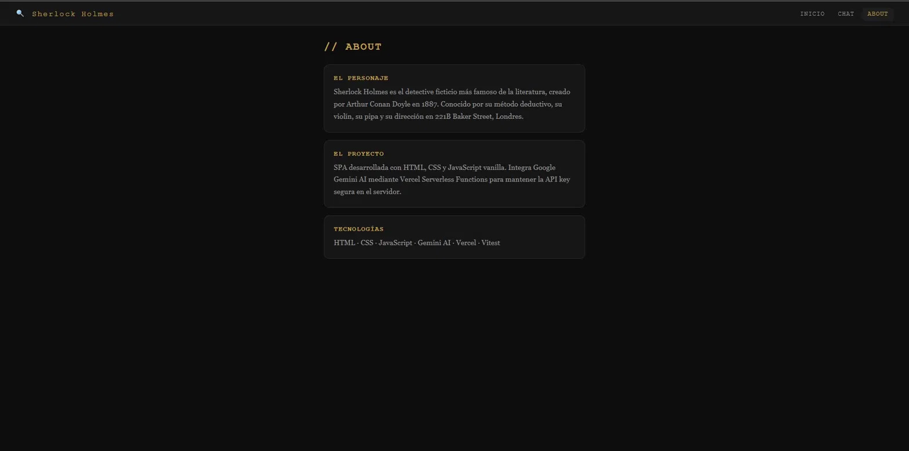

# Sherlock Holmes Chat

> "Cuando hayas eliminado lo imposible, lo que queda, por improbable que parezca, debe ser la verdad." — Sherlock Holmes

Aplicación web que permite conversar con Sherlock Holmes, el detective más brillante de la literatura victoriana, mediante inteligencia artificial. Desarrollada como Single Page Application con JavaScript vanilla, integra Google Gemini AI de forma segura a través de Vercel Serverless Functions.
---
## Tecnologias


---
[](https://proyecto-m3-sherlock.vercel.app)

---


---

## El Personaje

Sherlock Holmes fue creado por Arthur Conan Doyle en 1887 y se convirtió en el detective ficticio más famoso de la historia. Habita en el 221B de Baker Street, Londres, junto a su fiel compañero el Dr. Watson.

Su método deductivo, su capacidad de observación y su arrogancia intelectual lo hacen un personaje inconfundible. En esta aplicación responde con su característico tono: preciso, sarcástico y con elegancia victoriana. No esperes que sea amable, pero sí brillante.


---

## Estructura del proyecto

```
proyecto-m3-sherlock/
├── api/
│   └── functions.js        # Vercel Serverless Function (proxy seguro para Gemini)
├── src/
│   ├── app.js              # Routing SPA con History API
│   ├── chat.js             # Lógica del chat y localStorage
│   ├── styles.css          # Estilos mobile-first
│   └── utils.js            # Funciones utilitarias puras
├── tests/
│   ├── utils.test.js       # 10 tests de funciones utilitarias
│   └── app.test.js         # 4 tests de routing
├── index.html              # HTML principal
├── .env.example            # Variables de entorno requeridas
├── vercel.json             # Configuración de Vercel
├── package.json
└── README.md
```
## Capturas de pantalla

**Vista Home**


**Vista Chat**


**Vista About**


---
---

## Requisitos previos

- Node.js v18 o superior
- Cuenta en Vercel
- API key de Google Gemini — aistudio.google.com
- Vercel CLI: `npm install -g vercel`

---

## Ejecutar localmente

**1. Clona el repositorio:**
```bash
git clone https://github.com/Milowoxd/proyecto-m3-sherlock.git
cd proyecto-m3-sherlock
```

**2. Instala dependencias:**
```bash
npm install
```

**3. Configura las variables de entorno:**
```bash
cp .env.example .env
```

Abre `.env` y agrega tu API key:
```
GEMINI_API_KEY=tu_api_key_aqui
```

**4. Vincula con Vercel:**
```bash
vercel link
vercel env pull
```

**5. Ejecuta el servidor local:**
```bash
vercel dev
```

**6. Abre en el navegador:**
```
http://localhost:3000
```

Nota: usa `vercel dev` y no Live Server. Live Server no ejecuta las Serverless Functions.

---

## Ejecutar tests

```bash
npm run test:run
```

Resultado esperado: 14 tests pasando en 2 archivos.

---

## Desplegar en Vercel

**1. Conecta el repositorio:**
```bash
vercel link
```

**2. Agrega la variable de entorno:**
```bash
vercel env add GEMINI_API_KEY
```

**3. Despliega a producción:**
```bash
vercel --prod
```

---

## Tecnologías utilizadas

| Tecnología | Uso |
|---|---|
| HTML + CSS + JavaScript | Frontend vanilla sin frameworks |
| History API | Routing SPA sin recargas |
| Google Gemini 2.5 Flash | Motor de IA |
| Vercel Serverless Functions | Proxy seguro para la API key |
| localStorage | Persistencia del historial de chats |
| Vitest | Tests unitarios |
| Vercel | Deploy y hosting |

---

## Seguridad

La API key de Gemini nunca se expone en el frontend. El flujo es:

```
Frontend → /api/functions (Vercel) → Gemini API
```

La Serverless Function actúa como proxy: recibe los mensajes del frontend, llama a Gemini con la API key desde el servidor, y devuelve la respuesta.

---

## Registro de uso de AI

Este proyecto fue desarrollado con asistencia de Claude (Anthropic) como herramienta de aprendizaje y desarrollo.

### Prompts utilizados y decisiones tomadas

**1. Arquitectura del proyecto**
- Prompt: "Como organizar una SPA en vanilla JS con routing, chat y serverless functions?"
- Decisión: Separar responsabilidades en `app.js` (routing), `chat.js` (lógica del chat) y `utils.js` (funciones puras testeables).

**2. System prompt de Sherlock**
- Prompt: "Diseña un system prompt para Sherlock Holmes que mantenga el personaje y de respuestas cortas de maximo 2 oraciones."
- Decisión: Definir reglas estrictas de personalidad, limitar respuestas a 2 oraciones y manejar preguntas modernas con curiosidad victoriana.

**3. Serverless Function**
- Prompt: "Por que usar module.exports en vez de export default en Vercel Functions?"
- Decisión: Las Vercel Functions corren en Node.js con CommonJS. El frontend usa ES Modules porque corre en el navegador. Son sistemas distintos.

**4. Configuracion de vercel.json**
- Prompt: "Como configurar vercel.json para servir archivos estaticos y una serverless function al mismo tiempo?"
- Decisión: Usar rewrites para separar rutas /api de las rutas de la SPA.

**5. Debugging**
- Se uso Claude para resolver errores de configuracion de rutas, MIME types y modelos de Gemini disponibles.

**6. Tests unitarios**
- Prompt: "Que funciones son las mas importantes para testear en este proyecto?"
- Decisión: Testear las funciones puras de `utils.js` porque no dependen de la red ni del DOM, lo que las hace ideales para unit tests.